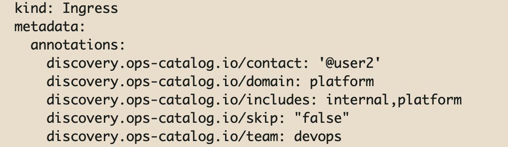

Endpoints can be found in many different targets like Cloud LB, Kubernetes Ingress, Gateway API etc.

### Kubernetes
When you configure Kubernetes for workload discovery, you get Endpoints like Ingress, HTTPRoute, TCPRoute for free.

Discovery Annotations under ```Metadata.Annotations``` are recognised and processed by discovery agent for endpoints.

Eligible annotations start with ```discovery.ops-catalog.io/```

