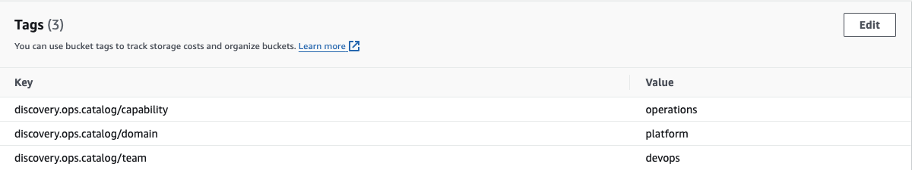

Resources can be discovered from a whole lot of targets like Object Store, Databases, Kafka etc.
We share the configuration for each type of discovery below:

### S3 Buckets

Here is a configuration to retrieve buckets from S3.

```yaml
apiVersion: "v1"
kind: Discovery
metadata:
  name: "s3-discovery"

type: aws 
instance:
  - name: "s3-1"
    filter:
      excludes: [".*"]
      includes: ["spark.*", "gpg.*", ".*biller", "aws-sts.*"]

    includes:
      - internal
      - data-platform
    classification:
      team: "datahoarders"
      domain: "storage"
      capability: "dataretention"
    options:

      host: "s3.ap-southeast-2.amazonaws.com"
      port: "443"

      username: "file:./tmp/access_key"
      password: "file:./tmp/secret_key"
      region: "ap-southeast-2"

      ssl: "true"
```

This is just like any discovery config, the only difference is the region information.

Discovery annotations can be retrieved from storage resources like S3 buckets.



### Airflow Dags
Airflow Dags discovery requires airflow instance to have REST API enabled.

```yaml
apiVersion: "v1"
kind: Discovery
metadata:
  name: "airflow-discovery"

type: airflow

instance:
  - name: "airflow-1"
    includes:
      - internal
    options:
      host: "airflow.ops-catalog.io"
      port: "8280"
      username: "admin"
      password: "file:./tmp/airflow"
      ssl: "false"
    classification:
      team: "dataplatform"
      domain: "jobs"
      capability: "jobs"
```
Object level enrichment overrides will be applied from tags array found in Dags API

### Kafka Topics
Here is a config for Kafka discovery

```yaml
apiVersion: "v1"
kind: Discovery
metadata:
  name: "kafka-discovery"

type: kafka

instance:
  - name: "kafka-1"
    includes:
      - internal
    options:
      host: "kafka.ops-catalog.io"
      port: "9092"
      ssl: "false"
    classification:
      team: "keepers"
      domain: "storage"
      capability: "operations"
```

### Postgres Schema
Similarly, a postgres example is presented here

```yaml
apiVersion: "v1"
kind: Discovery
metadata:
  name: "pg-discovery"

type: postgres
instance:
  - name: "pg-1"
    includes:
      - internal
    classification:
      team: "datahoarders"
      domain: "storage"
      type: "Schema"
      capability: "dataretention"
    options:
      host: "postgres.ops-catalog.io"
      port: "5432"
      username: "postgres"
      password: "file:./tmp/pgpassword"
      ssl: "false"
      database: "servicing"

  - name: "pg-2"
    options:
      host: "postgres.ops-catalog.io"
      port: "5432"
      username: "postgres"
      password: "file:./tmp/pgpassword"
      ssl: "false"
      database: "preferences"
```
Note you can have as many instance configs as you like. Here we are discovering schemas from two different databases inside the same database host. We are enriching one discovery with ownership information whereas the other one is not enriched at discovery time.

Schema level overrides can be applied in the form of Postgres Schema comments.

Example comment:

```sql
COMMENT ON
    SCHEMA refdata IS '{
    "discovery.ops.catalog/skip": "false",
    "discovery.ops.catalog/team": "notifiers", 
    "discovery.ops.catalog/domain": "jobs",
    "discovery.ops.catalog/capability": "datamart",
    "discovery.ops.catalog/includes": "data-stuff,internal"
  }';
```

### Cassandra Keyspaces
Cassandra Keyspace discovery config is very similar to other discovery types.

```yaml
apiVersion: "v1"
kind: Discovery
metadata:
  name: "cassandra-discovery"

type: cassandra

instance:
  - name: "cassandra-1"
    options:
      host: "cassandra.ops-catalog.io"
      port: "9042"
      username: "cassandra"
      password: "file:./tmp/casspassword"
      ssl: "false"
    includes:
      - internal
    classification:
      team: "datahoarders"
      domain: "storage"
      type: "Keyspace"
      capability: "dataretention"
```

It is not possible to add comment to Cassandra Keyspace. Hence we look for a table called catalog and read its comment if available to perform item level override.

```sql
CREATE TABLE catalog (
    ID text primary key,
    CONTENT BLOB
) WITH 
comment = '{
  "discovery.ops.catalog/skip": "false",
  "discovery.ops.catalog/team": "account", 
  "discovery.ops.catalog/domain": "onboarding",
  "discovery.ops.catalog/capability": "onboarding",
  "discovery.ops.catalog/includes": "onboarding-stuff,internal"
}';
```

### Git Repositories
Given that a Repository source is an attribute contained by a Catalog Item representing an app, it is possible that you want to only include select git projects as catalog item (ones which are used by GitOps). 

```yaml
apiVersion: "v1"
kind: Discovery
metadata: 
  name: "github"

type: git

instance:
  - name: "personal-github"
    includes:
      - internal
    filter: 
      includes: [".*by-example", ".*playground"]
    options: 
      host: "api.github.com"
      port: "443"
      username: "file:./tmp/githubusername"
      password: "file:./tmp/githubpassword"
      ssl: "true"
    classification:
      team: "devexp"
      domain: "platform"
      capability: "operations"
    duplicatesStrategy: "ignore" 

  - name: "org-github"
    includes:
      - internal
    filter:
      excludes: [".*"]
      includes: [".*examples", ".*specification"]
    options: 
      host: "api.github.com"
      port: "443"
      username: "file:./tmp/githubusername"
      password: "file:./tmp/githubpassword"
      ssl: "true"
      org: "ops-catalog"
      use-hints: "false"
    classification:
      team: "devexp"
      domain: "platform"
      capability: "operations"
    duplicatesStrategy: "ignore" 

```

For the second github instance, we are choosing not to look for enrichment data in a special tag as we provide the attribute ```use-hints: "false"```

It is also possible to store all Git Repositories in Ops Catalog. A recommended setup is to run separate instance of OpsCatalog for the purpose of Discovering and Provisioning all Git repositories for your organisation.


Further enrichment hints can be provided to Git Discovery module by creating a "tag" by the name "catalog".

```shell
 git tag -m'{
  "discovery.ops.catalog/skip": "false",
  "discovery.ops.catalog/team": "data",
  "discovery.ops.catalog/domain": "jobs",
  "discovery.ops.catalog/capability": "analytics",
  "discovery.ops.catalog/includes": "data-stuff,internal"
}' catalog
git push --tags
```

