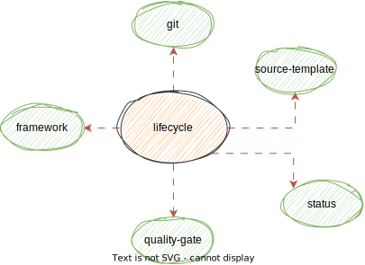

### The major components

There are eight major categories of attributes in a catalog item.

| Category       | Description                                                                                                               |
|----------------|---------------------------------------------------------------------------------------------------------------------------|
| Metadata       | Catalog Item name, a few key attributes and various options to add additional data in the form of labels and annotations. |
| Contact        | Ownership and Collaborator details along with role they play for the catalog item.                                        |
| Properties     | Properties associated with catalog item                                                                                   |
| Links          | Collection of external links by intent - eg source, quality, test, build                                                  |
| Dependencies   | Information on upstream, downstream and dependency on resources                                                            |
| Classification | A collection of attributes to categorise the catalog item                                                                 |
| Runtime        | Information on entry points, key URIs and augmentation of discovered data                                                 |
| Audit          | Audit Log about information captured in this catalog item                                                                 |

#### Versioning
Ops Catalog Spec uses the kind and version attribute made popular by Kubernetes to specify the object type and apiVersion.

```yaml
apiVersion: "v1"
kind: Component
metadata: {}
```

#### Metadata

The metadata section of the document contains the following key attributes.

| Attribute Name         | Description                                                                                  |
|------------------------|----------------------------------------------------------------------------------------------|
| name                   | Name of the catalog item                                                                     |
| description            | Text describing the catalog item                                                             |
| labels                 | A map structure that can hold custom attributes to tag this artifact with                    |
| tier            | This attribute records the priority of the catalog entry in terms of urgency values Tier 1-5 |
| layer           | This attribute denotes the catalog runtime tier                                              |
| annotations            | A map structure that can hold additional enrichment data                                     |                  |
| logo                   | Catalog item logo name or location                                                           |
| contact                | Id that can be used to contact the owners of this catalog item for support                   | 
|license                 | Applicable License for this catalog item e.g. Apache 2.0, Private, Commercial, GPL, BSD etc|

```tier```, ```contact``` and ```layer``` are automatically copied by the implementation as attributes under labels. This helps pass this information to other DevOps processes (eg. Deployment) and the same information can be used for search.

The below yaml snippet shows an example metadata section of a catalog item.

```yaml
metadata:
  name: "user-service"
  description: "This microservice provides customer information"
  labels:
    internet-facing: true
  annotations: { }
  tier: 1
  layer: web  
  language: go
  logo: "user-service.svg"
  contact: "user-service@example.io"
  license: "private"
```

#### Contact

There can be a number of contacts, a team or an individual can play with regards to the maintenance of a project.
While there can be a single owner from accountability perspective, a catalog item
can have many contributors playing different roles.

Few roles such as owner, contributors, support are explicitly laid out and additional roles can be configured as approvers by specifying the intent.

The ```id``` attribute holds the value of a contact ID of a team or individual using the following well known ID
formats.

| Id Type      | Example         | Fully Qualified Example                 |
|--------------|-----------------|-----------------------------------------|
| username     | @user1          | id://user1, ad://1600920                |
| team         | web-team        | team://web-team                         |
| group        | [approvergroup] | group://approvergroup                   |
| email        | web@company.com | email://web@company.com                 |
| chat channel | #slackChannel   | slack://slackChannel, mattermost://channel2 |
| phone        | +6189209999     | tel://+6189209999, mob://+6189209999    |

As there can be a variety of ID providers and chat providers, an ```IDProviderConfig``` object can be specified 
to specify the defaults. 

The below yaml snippet shows contact configuration example for a catalog item.

```yaml 
contact:
  owner:
    id: "@user1"
  contributors:
    - id: "web-team"
    - id: "web@example.com"
  support:
    - id: "#slackChannel"
    - id: "mattermost://web-support"
    - id: "+6189209999"
  participants:
    - id: "[CodeApprovers]"
      intent: "approvers"
    - id: "some-team"
      intent: "maintenance"
    - id: "leadership"
      intent: "stakeholders"
```

#### Properties
While catalog metadata could be used to store associated properties, a dedicated section helps with clarity and access. It is because of this reason, the recommended way to 
store properties is by using the ```properties``` attribute.

To ensure compatibility with industry trend around specifying config under annotations, this version of the specification also supports the annotation mode.

The following seven namespaces are recognized and this means that the API and tooling around the specification should support operations for these namespaces:

| Namespaces  | Description                                                                   |
|-------------|-------------------------------------------------------------------------------|
| lifecycle   | List of config properties describing the catalog item's lifecycle and actions |
| build       | List of config properties used by build tools                                 |
| dev         | List of attributes for dev mode like local runs, tests and one-liner command  |
| operations     | List of attributes associated with runtime state of this catalog item         |
| preferences | List of flags one might require for this catalog item                         |
| resources   | A resource namespace can be used to highlight resource specific requirements  |
| custom      | Where basic tooling support is required for uncategorised properties          |

The below snippet shows properties provided as annotation under each recognised namespace. The annotation keys are prefixed with <namespace>.ops.catalog/  

```yaml
metadata:
  annotations:
    lifecycle.ops.catalog/git: "managed"
    lifecycle.ops.catalog/status: "active"
    lifecycle.ops.catalog/source-template: "microservices-starter"
    lifecycle.ops.catalog/quality-gate: "true"
    lifecycle.ops.catalog/framework: "spring-boot"
    lifecycle.ops.catalog/language: "java"
    
    build.ops.catalog/docker: "true"
    build.ops.catalog/gradle-wrapper: "true"
    build.ops.catalog/command: "./gradlew clean build"
    
    dev.ops.catalog/quickstart: "./gradlew runApp"
    dev.ops.catalog/local-run: "docker-compose up -d"
    dev.ops.catalog/test: "./gradlew clean build"
    
    operations.ops.catalog/idempotent: yes
    operations.ops.catalog/cron: "0 * * * *"
    
    resources.ops.catalog/profile: "cpu-medium"
    resources.ops.catalog/deploy: { cpu: 0.5, memory: "512m", class: "medium" }
    
    preferences.ops.catalog/show-login: "false"
    custom.ops.catalog/http-requests: {"timeout": 10s, "verify-tls": "true"}
```

Specification using properties attribute.
```yaml
properties:
  lifecycle:
    git: "managed"
    status: "active"
    source-template: "microservices-starter"
    quality-gate: "true"
  dev:
    quickstart: "./gradlew runApp"
    local-run: "docker-compose up -d"
  build:
    docker: "true"
    gradle-wrapper: "true"
    command: "./gradlew clean build"
  operations:
    idempotent: "yes"
    cron: "0 * * * *"
  preferences:
    show-login: false
  custom:
    http-requests: 
      timeout: 10s
      verify-tls: true
```

In the diagram below, attributes such as source template and status are properties under the lifecycle scope.



If there is a conflict, configuration specified under properties attribute will override the ones in annotations. While the implementation can perform a merge operation, 
it is recommended to stick to one of the two approaches to avoid surprises.

#### Links
An item can have many different concerns housed in other systems. We can collect required information using the link object array.

To allow for extension and multiple links for similar intent, the type attribute can have classifier suffix as shown in the table below.

| Link Type         | Description                                                                                  |
|-------------------|----------------------------------------------------------------------------------------------|
| source            | Specify location from which source can be retrieved                                          |
| artifact          | Location of the artifact. When a classifier is not provided, it will be estimated.           |
| artifact/image    | Location of the container Image                                                              |
| artifact/jar      | Jar Artifact                                                                                 |
| contract          | Location where contract is located. When a classifier is not provided, it will be estimated. |
| contract/api      | API contract location                                                                        |
| contract/data     | Data contract location                                                                       |
| build             | Location of the build associated with this catalog item                                      |
| docs              | Various docs associated with the catalog item                                                |
| dashboard         | Dashboards associated with this catalog item                                                 |
| dashboard         | Observability Dashboards associated with this catalog item                                   |
| dashboard/logs    | Dashboards associated with this catalog item                                                 |
| dashboard/metrics | Dashboards associated with this catalog item                                                 |
| alerts | Alert Spec associated with this catalog item |
| chat              | Chat channel link if available                                                               |
| precondition | Precondition Contract or Spec for this catalog item to operate |

A yaml snippet showing links configuration for a catalog item.

```yaml
links:
  - type: source
    url: git@github.com:owner/abc.git
  - type: artifact/image
    url: docker://owner/abc
  - type: artifact/jar
    url: https://artifactory/owner/abc    
  - type: contract
    url: https://site/contract.json
  - type: build
    url: https://jenkins/owner/example/build/
  - type: chat
    url: https://slack/myteam
  - type: docs
    url: https://readthedocs.org/example
  - type: dashboard
    url: https://perf-dashboard/
```

#### Dependencies
Catalog Items often have dependencies on other items within a setup. An attribute ```upstream``` keeps track of what this application ends up consuming data from. ```downstream``` keeps track of what this item calls to share data.
Dependencies attribute captures information about resources or technology this catalog item relies on usually using upstream and downstream data.  

```yaml 
dependencies:
  upstream: []
  downstream: []
  triggers: []
```
Similarly, triggers is an array of entries which are dependent on the execution of this. ```triggers``` may be useful in a pipeline or to configure watch notifications upon changes.

#### Classification

Classification attributes help us filter or group assets based on their type and category they belong to. Additionally, they can be tagged to extend further to capture cross-cutting concerns or a general topic.

Let's establish the definition of what key terms like domain, capability mean in the context of ops catalog.

##### Capability
>> A group of product features that collectively provide a business level function. Examples of capabilities can be things like Operations, Credit Risk Assessment, Onboarding, Card Payment, Data Analytics, Client Experience.

##### Domain
>> Domain usually covers a specific area or features that a software solution aims to provide. Catalog items can be loosely clustered by domain in which a set of experts usually perform operations to minimise context switching and maximise efficiency. 

The classification node consists of the following attributes:

| Name       | Description                                                                              |
|------------|------------------------------------------------------------------------------------------|
| type       | Type of the catalog item - usually a hardware, software or tech                          |
| tag        | An array of labels to apply to this catalog item for filtering, search, grouping purpose |
| domain     | Domain of which this catalog item is a member of                                         | 
| capability | A specific product capability this catalog item is a part of                             |


The table below shows various kind, type and additional attributes associated with each type.

| Kind              | Type                                              | Attributes                                           |
|-------------------|---------------------------------------------------|------------------------------------------------------|
| Component         | App, Job                                          | all                                                  |
| Store             | Disk, SFTP, NFS, Bucket, Database, Messaging      | all                                                  |
| Pipeline          | Pipeline, Workflow                                | all, +graph                                          |
| Resource          | Schema, Keyspace, Collection, Index, Topic, Queue, Repository | providedBy attribute under dependencies pins resource to a provider              |
| Endpoint | HTTPRoute, TCPRoute, Ingress, ALB          | all                                        |
| Appliance         | VM, Hardware, Machine, Image                      | -dependencies                                        |
| Technology        | Library, Framework, Language, Technology          | -dependencies                                        |
| SecurityRule      | Firewall, SecurityGroup                           | +rule - from address, to address, port, toport       |
| SecurityRuleGroup | Firewall, SecurityGroup list                      | +rule[]                                              |
| Infrastructure    | Infrastructure                                    | +contains - appliance, store, component              |
| Environment       | Environment                                       | all, lifecycle.ops.catalog/schedule, lease           |
| Capability        | Capability                                        | contains - component                                 |
| Service           | SaaS, Jira, Confluence, Bitbucket, Kubernetes, AD | all                                                  |
| User              | User                                              | all, lifecycle.ops.catalog/id, +membership generated |
| Group             | Group                                             | all, +members, +roles                                |
| Role              | Role                                              | all, +permissions                                    |
| Provider          | IDProvider, DirectoryProvider, *Provider          | all, +attachment to pick the service to use          |


The yaml representation of the classification object can be like this:

```yaml
kind: Component
classification:
    type: "App"
    tag: ["payment", "customer"]
    domain: "payment"
    team: "paypaynow"
    capability: "onlinebanking"
```

#### Runtime
While it may seem like something that is relevant for applications, it is equally important
to store or discover runtime properties of an asset. Data such as entrypoint, liveness probe URLs and IP addresses,
can be collected to drive automation for deployment configurations and other automation tasks.

The table below shows the various intents and usage

| Intent      | Description                                                                                        |
|-------------|----------------------------------------------------------------------------------------------------|
| entrypoint  | Usually the first location used to access an asset                                                 |
| readiness   | Location which can be accessed to check if the catalog item is ready                               |
| liveness    | Location which can be accessed to check if the catalog item is alive                               |
| correctness | Location which can be accessed to verify that the catalog item is healthy and behaving as expected |
| address     | Location where the asset is, usually an IP address but could be other values as well               |

List of environments where the catalog item is deployed or available.

```yaml
runtime:
    endpoint:  
      - intent: entrypoint
        location: "http://host/app"
      - intent: readiness
        location: "/ready"
      - intent: liveness
        location: "/live"
      - intent: correctness
        location: "/correct"
      - intent: "address"
        location: "10.0.0.3"
    environment: 
      - prod
      - nonprod
      - test
```


Implementations may choose to store this level of data in a separate storage system and show this detail only when retrieving the catalog item.

### Normalisation
An implementation of the operations catalog is advised to perform following optimisations to make the search and access process simpler.

#### Copying key Attributes to labels

Attributes such as layer, tier and contact can be copied to labels so the consumers can take advantage of built-in search and filter operations.

before:
```yaml
metadata: 
  layer: web
  tier: 1
  contact: "user-service@example.io"
```

after:
```yaml
metadata:
  layer: web
  tier: 1
  contact: "user-service@example.io"
labels:
    core.ops.catalog/layer: web
    core.ops.catalog/tier: 1
    core.ops.catalog/contact: "user-service@example.io"
```

#### Adding Audit
The catalog items may be loaded and updated at various intervals. This section shows the information on changes and source of change. This is a dynamic part of the specification and may not be populated immediately.

Source attribute tells us how the catalog item was added. It can be one of api,crd,git

```yaml
audit:
  operations:
  - name: "updated"
    updated: "2023-07-01T10:00:00+1000"
    description: "App 1 caused dependency to be updated"
  source: api
```

#### Adding Annotations
The attributes associated with namespaces under properties will be copied and/or merged with annotations.

before:
```yaml
properties:
  lifecycle:
    source-template: "microservices-starter"
```

after:
```yaml
metadata:
  annotations: 
    lifecycle.ops.catalog/source-template: "microservices-starter"
properties:
  lifecycle:
    source-template: "microservices-starter"
```

### An Example

An example catalog item configuration looks like this:

```yaml 
apiVersion: "v1"
kind: Component
metadata: 
  name: "template"
  description: "Template for a Component"
  logo: "component.png"
  contact: "template@ops.catalog"
  labels: 
    tier: 1
    internet-facing: false
    layer: web
  annotations: {}
includes:
  - java-app
  - backend-team
contact: 
  owner: 
    id: "@user1"
  contributors:
    - id: "web-team"
  support: 
    - id: "#template"
  approvers:
    - id: "[DevExperience]"
properties: 
  lifecycle:
    status: "active"
links: 
  - type: source
    url: git@github.com:owner/abc.git
  - type: artifact/image
    url: docker://owner/abc
  - type: artifact/jar
dependencies: 
  upstream: []
  downstream: []
  triggers: []
runtime: 
  endpoint:
    - intent: entrypoint
      location: "http://template/app"
    - intent: "readiness"
      location: "/ready"
  environment:
    - prod
    - nonprod
    - test
classification: 
    type: ""
    tag: []
    domain: ""
    team: ""   
    capability: ""
audit: {}
```

### Includes
While it is nice to view all the attributes associated with a catalog item in a single response. Managing a denormalised entry can be a pain. Templates help solve refactor
your config management further to keep it tidy. Certain traits can be captured as templates and included into each catalog entry.

The following attribute can are allowed in the template specification.

| Attribute      | Description                                                           | Action | Applicable |
|----------------|-----------------------------------------------------------------------|--------|------------|
| apiVersion     | every item evolves separately                                         |        | ❌          |
| kind           | need to be specific for each item                                     |        | ❌          |
| metadata       | can merge as many attributes and can be shared                            | merged | ✅          |
| contact        | merge is supported to allow teams to have contact in one place        | merged | ✅          |
| properties     | merge is supported to allow multiple components to reuse properties   | merged | ✅          |
| links          | links should be unique but there might be a case of reuse             | merged | ✅          |
| dependencies   | should be unique. very important so do not take shortcut on this one. |        | ❌          |
| classification | can be reused by apps in a domain, team                               | merged | ✅          |
| runtime        | if using same framework, most attributes could be reused              | merged | ✅          |

Template will always be applied first. The more local declaration of attributes in each catalog entry will override any data template might have added. It also does not always make sense to overwrite or merge data when importing from template. The above table shows the merge strategy applied for each attribute that can be put in template.


