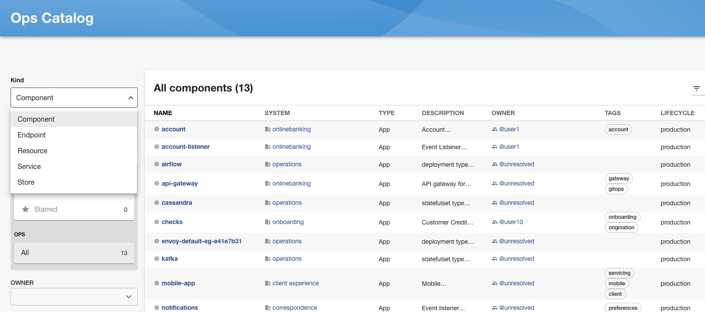
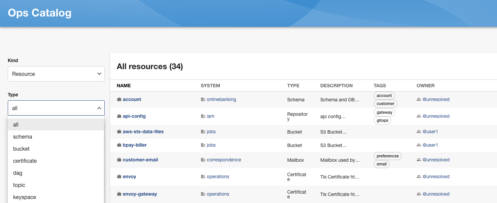
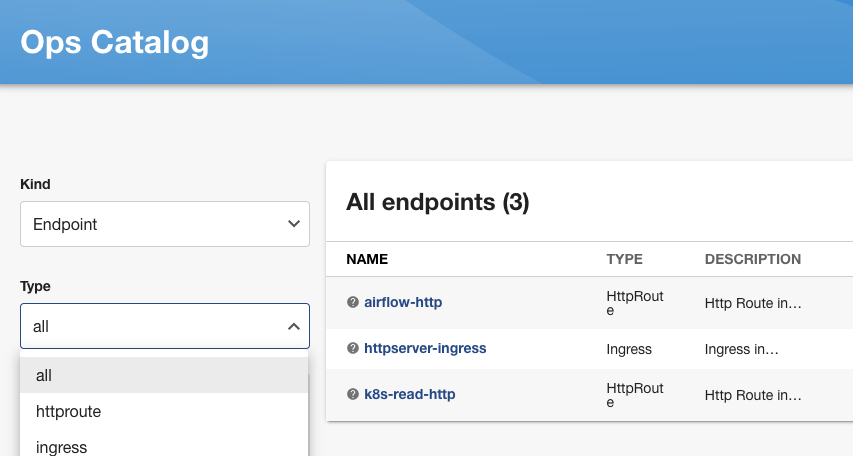

Ops-Catalog can be used from right within Backstage by adding a Catalog mapping plugin like so:

#### Create plugin with CatalogBuilder

path: packages/backend/src/plugins/catalog.ts
```ts

import { CatalogBuilder } from '@backstage/plugin-catalog-backend';
import { PluginEnvironment } from '../types';
import { OpsProvider } from './OpsProvider';
import { OpsProcessor } from './OpsProcessor';

export default async function createPlugin(
  env: PluginEnvironment,
): Promise<any> {
  const builder = CatalogBuilder.create(env);
  const frobs = new OpsProvider(env);
  builder.addEntityProvider(frobs);
  builder.addProcessor(new OpsProcessor());
  const { processingEngine, router } = await builder.build();
  await processingEngine.start();
  await env.scheduler.scheduleTask({
    id: 'run_ops_refresh',
    fn: async () => {
      await frobs.run()
    },
    frequency: { minutes: 2 },
    timeout: { minutes: 1 },
  });
  return router;
}

```
#### Create Processor
path: packages/backend/src/plugins/OpsProcessor.ts

```ts
import {
    Entity,
  } from '@backstage/catalog-model';
  import {
    CatalogProcessor,
    CatalogProcessorEmit,
  } from '@backstage/plugin-catalog-node';
  import { LocationSpec } from '@backstage/plugin-catalog-common';


  export class OpsProcessor implements CatalogProcessor {
    getProcessorName(): string {
      return 'OpsProcessor';
    }
  
    private readonly validators = [];
  
    async validateEntityKind(entity: Entity): Promise<boolean> {
      return entity.apiVersion === "v1";
    }
  
    async postProcessEntity(
      entity: Entity,
      _location: LocationSpec,
      emit: CatalogProcessorEmit,
    ): Promise<Entity> {
  
      return entity;
    }
  }

```

#### Create Mapping
path: packages/backend/src/plugins/OpsProvider.ts

```ts
import {
  ANNOTATION_LOCATION,
  ANNOTATION_ORIGIN_LOCATION,
} from '@backstage/catalog-model';
import {
  EntityProvider,
  EntityProviderConnection,
} from '@backstage/plugin-catalog-node';
import { PluginEnvironment } from '../types';

export class OpsProvider implements EntityProvider {
  private connection?: EntityProviderConnection;
  private env: PluginEnvironment;

  public constructor(env: PluginEnvironment) {
    this.env = env;
  }
  getProviderName(): string {
    return `ops-catalog`;
  }

  public async connect(connection: EntityProviderConnection): Promise<void> {
    this.connection = connection;
  }

  async run(): Promise<void> {
    if (!this.connection) {
      throw new Error('DB not initilized');
    }
    const catalogObj: any[] = [];
    const catalogResponse = await fetch('http://localhost:8080/api/catalog');
    const d = await catalogResponse.json();

    for (const entity of d.data) {
      let linkSource = entity.links || [];
      const links = linkSource.map((link:{url:string, type:string}) => {
        return {
          url: link.url,
          title: link.type
        }
      });
      let apiVersion = 'backstage.io/v1alpha1';
      let kind = entity.kind;
      switch(kind) {
        case 'Resource':
          break;
        case 'Component':
          break;
        default:
          apiVersion = entity.apiVersion;
      }
      let dependenciesSource = entity.dependencies || { downstream: [], upstream: []};
      let dependencies = (
        dependenciesSource.downstream || []).concat(dependenciesSource.upstream || []
        );

      let name = `${entity.metadata.name.replaceAll(" ", "")}`;
      let owner = '@backstage/maintainers';
      if (entity.contact.owner) {
        owner = `${entity.contact.owner.id}`; 
      }
      let annotations = entity.metadata.annotations || {};
      annotations[ANNOTATION_LOCATION] ='ops:https://ops-catalog.io/';
      annotations[ANNOTATION_ORIGIN_LOCATION]='ops:https://ops-catalog.io/';

      let tags = entity.classification.tag || [];
      let sourceLabels = entity.metadata.labels || {};
      let labels = new Map(Object.entries(sourceLabels)
      .map(([k,v]) => [k,String(v).replaceAll(" ", "").replaceAll("@", "_at_")]))
      let system = entity.classification.capability || "unknown";
      const catalogEntity = {
        kind: kind,
        apiVersion: apiVersion,
        metadata: {
          description: `${entity.metadata.description}`,
          annotations: annotations,
          labels: labels,
          links,
          // name of the entity
          name: `${name}`,
          title: `${name}`,
          tags: tags,
        },
        spec: {
          type: `${entity.class}`,
          lifecycle: 'production',
          owner: owner,
          profile: {
            displayName: `${entity.metadata.name}`,
            email: '',
            picture: '',
          },
          dependsOn: dependencies,
          memberOf: [],
          system: `${system}`
        },
      };

      catalogObj.push(catalogEntity);
    }

    await this.connection?.applyMutation({
      type: 'full',
      entities: catalogObj.map(entity => {
        return { entity, locationKey: 'ops:https://ops-catalog.io/' };
      }),
    });
  }
}
```
#### UI
This will show new Kinds in backstage and the relationship defined in ops-catalog will be visible there too.

##### Component View


##### Resource View


##### Endpoint View

